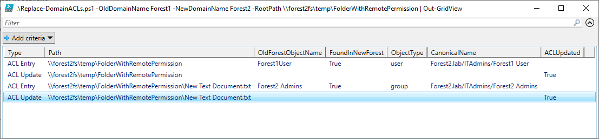

# Replace-NTFSDomainACLs.ps1
## Typical use scenario
You are migrating from an old forest to a new one. Your file shares already have permissions that point
to users and groups in the old domain. Given that you arleady created new users in the new domain with the same SamAccountName,
you can use this script to go through each file and replace existing Access Rules from the old domain with idenitical ones that
point to the new domain.

>The script requires cmdlets from the **ActiveDirectory** module.

>For best performance, use local paths instead of network locations. However network URLs are supported.

**Example 1**
```PowerShell
.\Replace-NTFSDomainACLs.ps1 -OldDomainName "OldDomain" -NewDomainName "NewDomain" -RootPath D:\FileShares\ExampleShare | Out-GridView
```

This will check the security permissions on each file under the root path, for each file where permissions are not inherited and
the Access Rule belong to objects in OldDomain, the script will try to find a match with the same username in NewDomain. If a 
match is found, the script will add a new rule idenitical to the old one, and remove the OldDomain entry.

The results will be displayed in a Grid View.



**Example 2**
```PowerShell
.\Replace-NTFSDomainACLs.ps1 -OldDomainName "OldDomain" -NewDomainName "NewDomain" -RootPath D:\FileShares\ExampleShare -CSVLogPath C:\temp\example.csv
```

Same as the first example, additionally this will save the results in CSV file.
